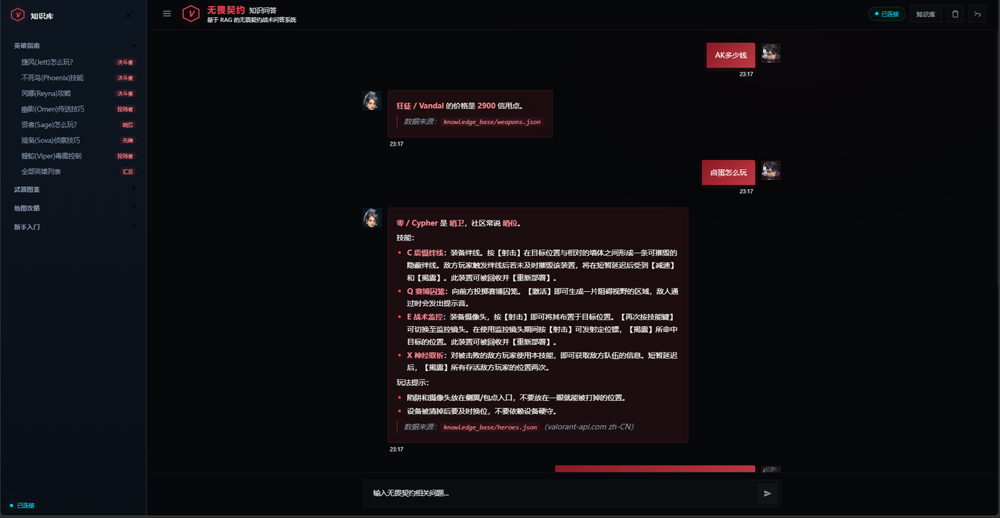
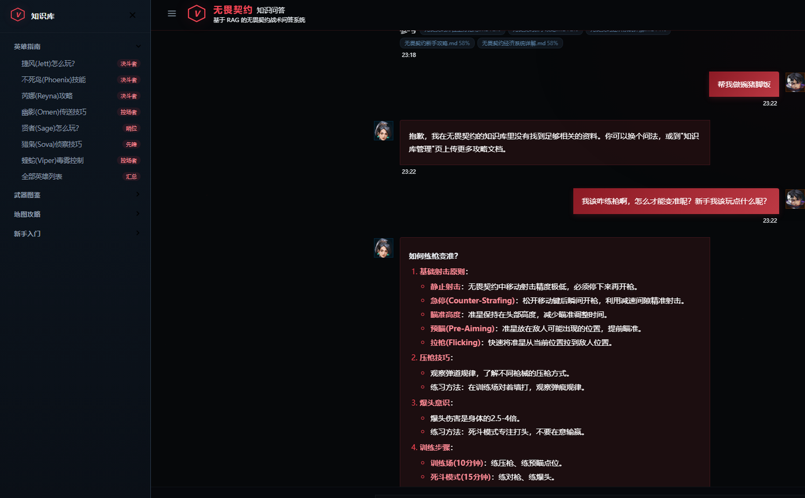
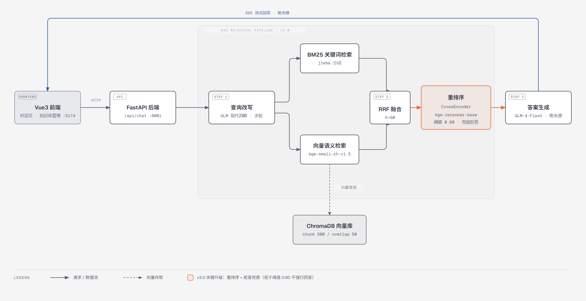

# 无畏契约 · 智能问答助手（VALORANT RAG Assistant）


把散落在网页、图鉴、攻略里的游戏知识收进一个能版本管理的知识库，让 AI 边检索边回答，每条结论都指得出出处。

后端 FastAPI + LangChain + ChromaDB，前端 Vue 3 + Element Plus，大模型接智谱 GLM-4-Flash。

这个项目的重点不在"能聊天"。会聊天的机器人满地都是，它要解决的是另一头的问题：回答得有依据，来源能追溯，知识库能维护，**答不上来就明说，不瞎编**。

| 问答（答案带来源） | 拒答兜底（无关问题不硬答） |
|---|---|
|  |  |

## 它解决什么

玩家查"捷风怎么玩""幻影弹道怎么样""这张图怎么打"，得翻十几个网页、B 站视频和文档。信息零散，版本滞后，真假难辨。

这里把 VALORANT 资料统一收口成结构化知识库。用户提问先检索资料，再把命中的内容交给大模型组织成答案——拍脑袋回答变成查完资料再回答。回答下方会列出参考了哪些文档块，匹配分数多少；检索不到可靠依据时直接拒答，而不是编一个。

## 功能与特性

| 能力 | 说明 |
|------|------|
| 检索增强问答 | 先检索知识库，再交给 GLM 生成，降低幻觉 |
| **来源可追溯** | 每条回答展示命中的文档块与匹配分数 |
| **拒答兜底** | 重排分数低于阈值即拒答，消融实测拒答正确率 100%（详见[评测](#检索效果评估)） |
| 多轮对话 | 上下文记忆、连续追问、撤回到历史某一轮 |
| SSE 流式输出 | 打字机式逐字回答，不用干等 |
| 知识库管理 | 前端可视化上传 / 删除文档，自动解析、切分、向量化 |
| 别名与黑话 | 外号、拼音、错别字、武器俗名（AK/M4/沙鹰等）走别名表，英雄/武器/地图列表类问题走确定性回答 |
| 安全过滤 | 敏感词拦截，非游戏问题自动拒答 |
| 一键启动 | `start.bat` 同时拉起前后端 |

## 技术栈

| 层级 | 技术 |
|------|------|
| 后端框架 | FastAPI + Uvicorn |
| 大语言模型 | 智谱 GLM-4-Flash |
| RAG 框架 | LangChain 0.2.16 |
| 向量模型 | BAAI/bge-small-zh-v1.5（sentence-transformers 3.0.1） |
| 重排模型 | BAAI/bge-reranker-base（CrossEncoder） |
| 向量数据库 | ChromaDB 0.5.5 |
| 前端 | Vue 3 + Element Plus + Vite |

## 快速开始

> 前置要求：Python 3.10 或更高（[python.org 下载](https://www.python.org/downloads/)，安装时勾选 **Add Python to PATH**）、Node.js 18 或更高（[nodejs.org 下载](https://nodejs.org/)，选 LTS 版）。

**第 0 步：拿到代码。** 点本页上方绿色 `Code` 按钮选 `Download ZIP` 解压，或者装了 Git 的话执行：

```bash
git clone https://github.com/chtgogogo/valorant-rag-assistant.git
cd valorant-rag-assistant
```

**第 1 步：配置 API 密钥。** 到[智谱开放平台](https://open.bigmodel.cn/)注册，在"API 密钥"页免费领取一个密钥，然后在项目根目录新建名为 `.env` 的文本文件，里面只写一行：

```ini
ZHIPU_API_KEY=粘贴你的密钥
```

> - **值的两边不要加引号**。Windows cmd 下执行 `echo "ZHIPU_API_KEY=xx" > .env` 会把引号一起写进文件导致密钥失效，这是最常见的启动失败原因。建议直接用记事本创建编辑（另存为 UTF-8）。
> - 也可以复制仓库里的 `.env.example` 改名成 `.env` 再填。

**第 2 步：安装后端依赖**（在项目根目录打开终端）：

```bash
cd backend
python -m venv .venv
# Windows PowerShell:  .venv\Scripts\Activate.ps1
# Windows cmd:        .venv\Scripts\activate.bat
# macOS / Linux:      source .venv/bin/activate
pip install -r requirements.txt -i https://pypi.tuna.tsinghua.edu.cn/simple
```

**第 3 步：安装前端依赖**（另开一个终端，回到项目根目录）：

```bash
cd frontend
npm install --registry=https://registry.npmmirror.com
```

**第 4 步：启动。** Windows 最省事的做法是回到项目根目录**双击 `start.bat`**，会同时拉起两个窗口（后端 :8001、前端 :5174，报错不会闪退，能看到错误信息）。手动启动则分别执行：

```bash
cd backend && python main.py     # 终端 1：后端 :8001
cd frontend && npm run dev       # 终端 2：前端 :5174
```

浏览器打开 **http://localhost:5174** 即可使用。首次启动会自动下载 embedding 模型（约 92MB，已配国内镜像 hf-mirror.com 加速）。

> 遇到问题先看下方[常见问题](#常见问题)；cpolar 内网穿透把项目发布成公网可访问的演示地址，见 `docs/cpolar部署说明.md`。

## 架构



v3.0 的核心是三级检索管线：查询先经 GLM 改写（解决多轮对话里"它呢？""那枪呢？"这类指代），再并行跑 BM25 关键词检索（jieba 分词）与向量语义检索、用 RRF（K=60）融合，最后交给 CrossEncoder 重排序精排。**排在最前且分数过阈值（0.60）的 5 个文档块拼成上下文送进 GLM 生成答案；分数不达标直接走拒答话术，不强行回答**——这是本系统不瞎编的机制保证。

管线三段均可通过环境变量独立开关（`RAG_QUERY_REWRITE` / `RAG_HYBRID` / `RAG_RERANK`），方便对比消融。

## 检索效果评估

评估脚本在 `backend/scripts/evaluate_rag.py`，评测集在 `backend/eval/eval_set.json`（20 题：武器/英雄/玩法/术语 17 题 + 拒答 3 题）与 `eval_set_variants.json`（变体鲁棒性 8 题）。

**指标口径先说清楚**：拒答题只计拒答正确率，不参与检索指标，因此检索类指标的分母是 17；Hit@5 = 期望文档出现在前 5 条来源中的比例；MRR = 期望文档首次命中排名的倒数均值（排第 1 记 1 分、第 2 记 0.5……，衡量"排得靠不靠前"）；下表数据实测于 2026-09-18，`--skip-llm` 模式（只测检索与拒答，不调大模型）。

**消融实验**（逐个开关管线组件，看每段到底贡献了什么）：

| 管线组合 | 检索 Hit@5 | 检索 MRR | 拒答正确率 |
|---|---|---|---|
| A. 纯向量（v2 旧管线） | 70.6% (12/17) | 0.637 | 33% (1/3) |
| B. 纯向量 + 重排序 | 70.6% | 0.608 | **100%** |
| C. 混合检索（无重排） | 70.6% | 0.637 | 0% |
| D. 混合 + 重排序（v3 形态） | 70.6% | 0.598 | **100%** |
| 变体鲁棒性 8 题（D 形态：错别字/俗称/拼音/港台译名） | **100%** (8/8) | 0.854 | — |

复现方式（在 `backend` 目录，需已完成快速开始）：

```bash
# 消融四组：用环境变量组合 + --mode custom
RAG_HYBRID=0 RAG_RERANK=0 RAG_QUERY_REWRITE=0 python scripts/evaluate_rag.py --mode custom --skip-llm
RAG_HYBRID=0 RAG_RERANK=1 RAG_QUERY_REWRITE=0 python scripts/evaluate_rag.py --mode custom --skip-llm
RAG_HYBRID=1 RAG_RERANK=0 RAG_QUERY_REWRITE=0 python scripts/evaluate_rag.py --mode custom --skip-llm
RAG_HYBRID=1 RAG_RERANK=1 RAG_QUERY_REWRITE=0 python scripts/evaluate_rag.py --mode custom --skip-llm
# 变体鲁棒性
RAG_HYBRID=1 RAG_RERANK=1 RAG_QUERY_REWRITE=0 python scripts/evaluate_rag.py --mode custom --skip-llm --suite eval/eval_set_variants.json
```

**这组消融说明三件事，也是本项目的诚实结论：**

1. **拒答能力的唯一来源是重排序。** 不加重排时无关问题的相似度分也能过旧阈值（中文向量分数分布集中、区分度差），加重排后无关问题得分约 0.50、相关问题至少 0.67，阈值定 0.60 可精准拦住——消融里只要开重排，拒答就从 33% 跳到 100%，与混合检索是否开启无关。
2. **混合检索在本知识库上没有兑现检索收益。** Hit@5 与纯向量完全持平，MRR 甚至略降（BM25 把"教程里顺带提了一句 Jett"这类弱关联块挤进候选，入门级 reranker 的 6 个候选名额有限，纠不回来）。保留它是因为知识库规模上去之后向量召回会开始漏，这是 RAGFlow、QAnything 等项目采用混合架构的原因；但在当前规模下，它只为拒答分数提供了更好的区分度入口，检索精度上是零收益。
3. **查询改写在本评测中测不出效果**：评测集全部是单轮独立问题，没有指代需要消解，它的收益场景是多轮对话，这套单轮评测集覆盖不到（需调 LLM，未在 skip-llm 模式中开启）。

**已知局限，不藏着：**

- 评测集只有 20+8 题，数字的统计意义有限，一道题就是 ±5.9 个百分点；
- 阈值 0.60 是在这份评测集上调试的、又在同一份上报告，存在"用考卷练题再考同一张卷"的循环风险，生产化需要独立验证集与线上分数监控（方案见 `docs/学习-评测指标与面试追问.md`）；
- 知识库内容一旦修改，检索排序就会变化，评测数字随之改变——本文数字对应 2026-09-18 的知识库版本，改动知识库后请重跑评测再引用数字；
- "降低幻觉"目前靠检索依据 + 拒答兜底 + 来源可追溯三项机制保证，尚未建立端到端的答案忠实度自动评测（faithfulness，如 RAGAS），这是下一步工作。

## 常见问题

| 现象 | 原因与解法 |
|------|------|
| 报 401 / 鉴权失败 | 密钥无效。检查 `.env` 里 `ZHIPU_API_KEY` 两边**有没有引号或空格**（最常见）、是否复制完整、账号是否欠费；到智谱平台重新生成密钥后重启后端 |
| 启动卡在下载模型 / `hf-mirror` 超时 | 首次下载 92MB embedding 模型需几分钟；超时会自动重试，反复失败可挂代理或换网络后重启 |
| `python` 或 `npm` 提示"不是内部或外部命令" | Python / Node.js 没装或没勾 Add to PATH，装完**重开终端**再试 |
| PowerShell 提示"禁止运行脚本" | 执行 `Set-ExecutionPolicy -Scope CurrentUser RemoteSigned` 后重试，或改用 cmd / 直接双击 `start.bat` |
| 端口被占用（8001 / 5174） | 关掉占端口的进程，或在 `.env` 里改 `SERVER_PORT`、在 `frontend/vite.config.js` 里改前端端口 |
| 黑窗口一闪就没了 | 用 `start.bat` 启动（报错不闪退），或手动在终端里启动后端看完整报错 |

## 领域皮肤与企业化改造

领域内容已全部配置化，改造为任意企业知识助手不涉及 Python 代码：

1. **复制领域皮肤。** 把 `backend/config/domain_profiles/valorant.yaml` 复制一份改名（比如 `enterprise.yaml`），把里面的 `system_prompt`（人设与回答规范）、`fallback_answer` / `refuse_answer`（话术）、`custom_rules`（快捷指令）换成企业内容，`default_kb_id` 改成 `enterprise`。
2. **切环境变量。** 在 `.env` 里设置 `APP_DOMAIN=enterprise`。
3. **导入企业文档。** 通过前端"知识库管理"页上传企业制度、产品、FAQ 文档，或者运行 `python scripts/init_knowledge_base.py` 重建索引。

企业部署建议补上：

```env
AUTH_ENABLED=1          # 开启 API Key 认证
API_KEYS=你的密钥1,你的密钥2   # 多个用逗号分隔，请求头带 X-API-Key
```

已预留的企业化能力：问答审计日志（`backend/data/audit/`，合规留痕可回溯）、API Key 认证、多知识库隔离（kb_id 维度）。注意：当前 kb_id 是应用层过滤，不是文档级权限隔离，真实企业场景的权限方案见 `docs/学习-评测指标与面试追问.md`。

## 知识库

知识源文件在 `knowledge_base/`，可版本管理，运行时同步到 `backend/data/uploads/` 并向量化。预置 12 份文档（英雄、武器、地图、新手/进阶战术、经济系统、术语黑话、排位指南、练枪方法等）与官方结构化数据（`heroes.json` / `weapons.json` / `maps.json`），详细清单见 [`knowledge_base/README.md`](knowledge_base/README.md)。

更新知识库的两条路：前端"知识库管理"页上传 `.txt` / `.md` / `.docx` / `.pdf`，或直接调 `POST /api/document/upload`；批量改 `knowledge_base/` 下的 md 后，运行根目录 `重新索引.bat`（或 `python scripts/init_knowledge_base.py`）全量重建索引。**改完知识库记得重跑评测**，数字会变。

## 项目结构

```
├── backend/            # FastAPI 后端
│   ├── routers/        #   接口层（chat / document / vector）
│   ├── services/       #   业务层（检索管线 / 多轮记忆 / 官方数据同步）
│   ├── config/         #   集中配置 + 领域皮肤（domain_profiles）
│   ├── eval/           #   评测集（20 题主集 + 8 题变体）
│   └── scripts/        #   评测 / 索引重建 / 官方数据同步
├── frontend/           # Vue3 前端（对话页 / 知识库管理页）
├── knowledge_base/     # 可版本管理的知识源（12 篇 Markdown + 官方 JSON）
├── docs/               # 调研方案 / 部署说明 / 学习笔记 / 架构图与截图
├── data/               # 运行时数据（chroma_db / chat_history，自动生成，不入库）
├── start.bat           # 一键启动
└── 重新索引.bat         # 重建向量索引
```

## 开发说明

本项目由作者独立完成，涵盖：检索管线（查询改写 / 混合检索 / CrossEncoder 重排序）、评测体系（20+8 题评测集、双模式对比与消融实验）、领域配置化改造、前后端实现与部署脚本。

## 更新记录

- **v3.1（2026-09-18）** — 官方结构化数据接入（英雄/武器/地图确定性回答、别名黑话表）、评测脚本支持消融模式、补消融实验与评测口径说明、文档系统整理、MIT 许可证。
- **v3.0（2026-09-11）** — 三级检索管线上线（查询改写 + 混合检索 + CrossEncoder 重排序），拒答兜底机制，20 题评测集与评估脚本，SSE 流式输出。
- **v2.0（2026-09-04）** — 知识库管理页、RAG 配置集中化、来源相似度展示，知识源改为可版本管理。
- **v1.0（2026-07-04）** — 毕设初版：基础问答 + 知识库。

## 许可证

[MIT](LICENSE) — 可自由使用、修改与分发。

## 文档导航

- [docs/调研与升级方案.md](docs/调研与升级方案.md) — 同类项目调研与升级决策依据
- [docs/学习-评测指标与面试追问.md](docs/学习-评测指标与面试追问.md) — Hit@5/MRR 是什么、阈值怎么调怎么监控、企业权限怎么做、消融结果怎么读
- [docs/cpolar部署说明.md](docs/cpolar部署说明.md) — 内网穿透公网演示部署
